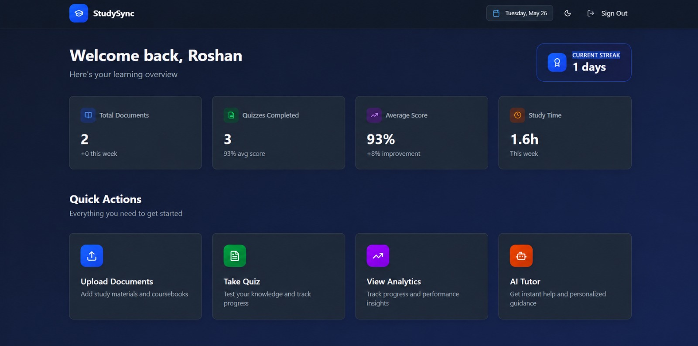
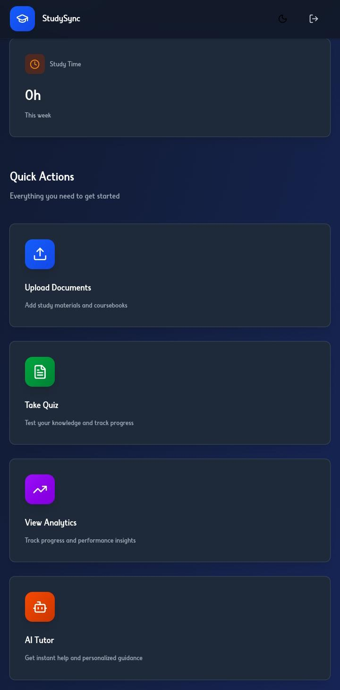
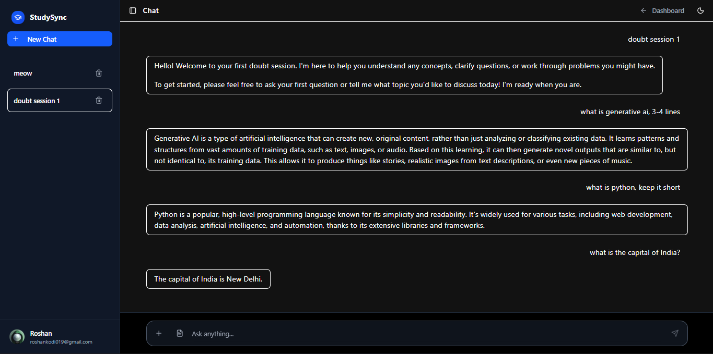
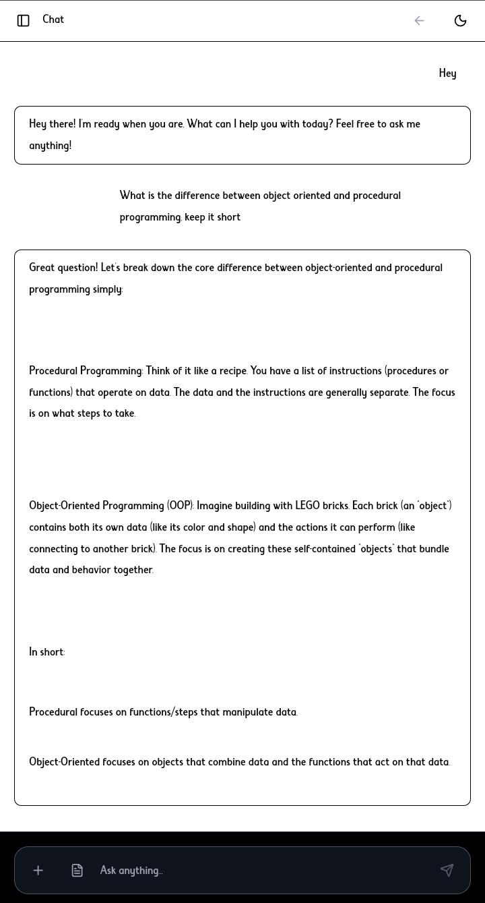
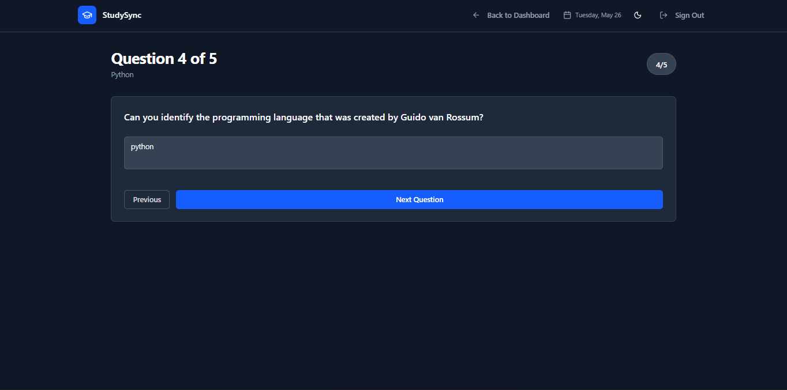
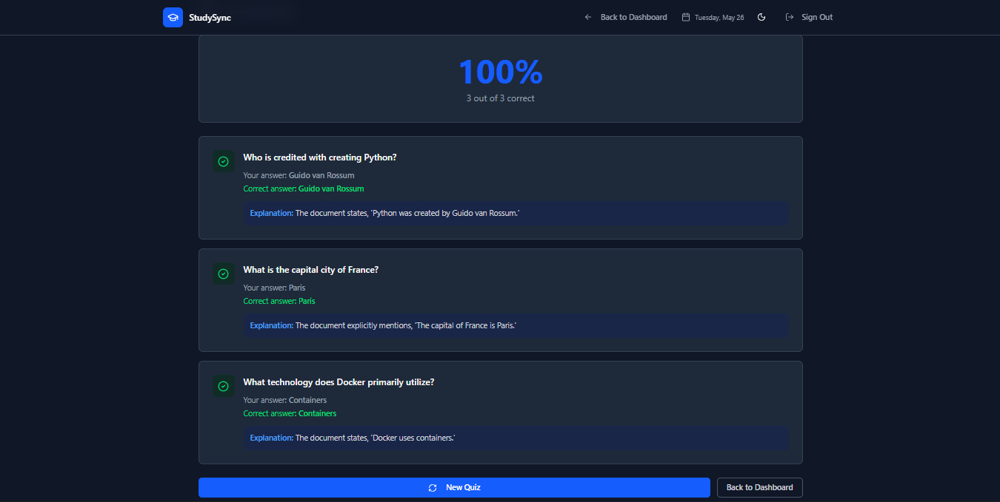
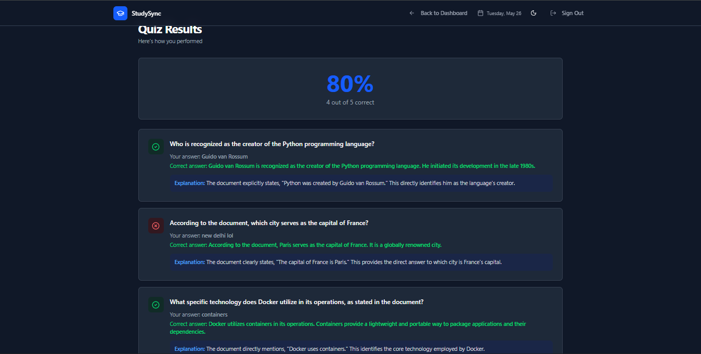
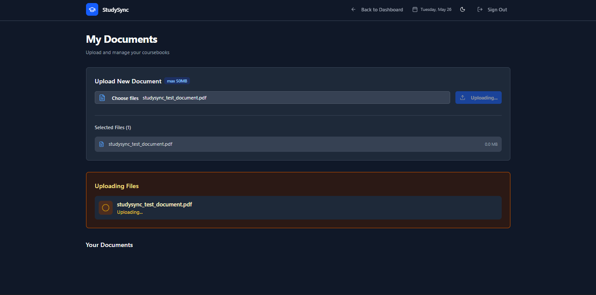
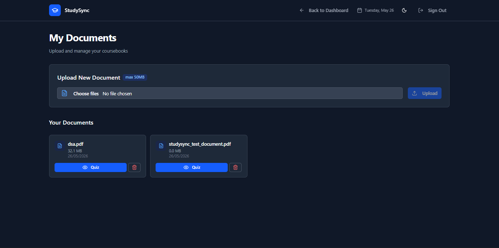

# StudySync

> AI-powered personalized learning platform that helps students learn smarter through intelligent tutoring, document analysis, quiz generation, AI summaries, and performance analytics.

---

# 🌐 Live Demo

🔗 https://studysync-8v0b.onrender.com

---

# ✨ Features

- 🤖 AI Tutor with conversational learning and real-time concept explanations
- 📄 AI-powered PDF analysis with contextual document understanding
- 📝 Automatic quiz generation supporting MCQ, SAQ, and LAQ formats
- 📚 AI summaries, revision notes, and key concept extraction
- 🔍 Semantic search powered by vector embeddings and RAG architecture
- 📊 Learning analytics with quiz tracking and performance insights
- 🌙 Modern responsive UI with dark/light mode support
- 🔐 Secure authentication using Google OAuth and NextAuth
- ⚡ Full-stack architecture powered by Next.js, Prisma, tRPC, Redis, and PostgreSQL
- 🐳 Docker-ready deployment with Render + Supabase integration

---

## 📸 Screenshots

### 🔐 Authentication
Secure Google OAuth authentication with protected routes and session management.


---

### 🏠 Dashboard
Centralized AI-powered learning dashboard with document management and analytics.





---

## 🤖 AI Tutor
Interactive AI-powered tutor capable of answering both document-based and general learning questions.





---

### 📝 AI Quiz Generator
Generate intelligent quizzes with MCQ, SAQ, and LAQ support instantly from study materials.




---

### 📊 Quiz Results & Evaluation
Real-time quiz evaluation with scoring, explanations, and performance insights.





---

### 📄 PDF Viewer & Document Processing
Upload, preview, and interact with study materials seamlessly.





---

# 🛠 Tech Stack

## Frontend
- Next.js 15
- React
- TypeScript
- Tailwind CSS
- shadcn/ui
- Framer Motion
- Lucide Icons

---

## Backend
- tRPC
- Prisma ORM
- PostgreSQL
- Redis
- NextAuth.js

---

## AI & Vector Technologies
- Google Gemini AI
- HuggingFace API
- Qdrant Vector Database
- RAG-based document retrieval

---

## Infrastructure & Deployment
- Render
- Supabase
- Docker

---

# 📂 Project Structure

```bash
src/
├── app/
├── components/
├── server/
├── lib/
├── hooks/
├── styles/
├── trpc/
├── types/
└── prisma/
```

---

# ⚙️ Environment Variables

Create a `.env` file in the root directory.

```env
AUTH_SECRET=
AUTH_TRUST_HOST=

DATABASE_URL=
DIRECT_URL=

GOOGLE_CLIENT_ID=
GOOGLE_CLIENT_SECRET=

GOOGLE_GENERATIVE_AI_API_KEY=
HUGGINGFACE_API_KEY=

NEXT_PUBLIC_AFF_URL=

NEXT_PUBLIC_SUPABASE_ANON_KEY=
NEXT_PUBLIC_SUPABASE_URL=

NEXTAUTH_SECRET=
NEXTAUTH_URL=

QDRANT_API_KEY=
QDRANT_URL=

REDIS_URL=

SUPABASE_SERVICE_ROLE_KEY=
SUPABASE_URL=
```

---

# 🚀 Getting Started

## 1️⃣ Clone Repository

```bash
git clone https://github.com/roshankodi/StudySync.git
cd StudySync
```

---

## 2️⃣ Install Dependencies

```bash
npm install
```

---

## 3️⃣ Generate Prisma Client

```bash
npx prisma generate
```

---

## 4️⃣ Push Database Schema

```bash
npx prisma db push
```

---

## 5️⃣ Start Development Server

```bash
npm run dev
```

Application will run on:

```txt
http://localhost:3000
```

---

# 🐳 Docker Support

Build Docker image:

```bash
docker build -t studysync .
```

Run container:

```bash
docker run -p 3000:3000 studysync
```

---

# 🧠 AI Capabilities

StudySync uses Retrieval-Augmented Generation (RAG) architecture to:
- Understand uploaded documents
- Generate context-aware responses
- Create intelligent quizzes
- Summarize learning materials
- Deliver personalized tutoring experiences

---

# 📈 Future Improvements

- Flashcard generation
- Voice AI tutor
- Collaborative study rooms
- Real-time multiplayer quizzes
- Personalized learning recommendations
- Advanced semantic evaluation
- Multi-document reasoning

---

# 👨‍💻 Author

## Kodi Roshan

Computer Science Engineering Student • Full-Stack Developer • AI Enthusiast

GitHub:
https://github.com/roshankodi

---

# 📄 License

This project is licensed under the MIT License.

---

# ⭐ Support

If you found this project useful:

- Star the repository
- Fork the project
- Share feedback and suggestions

---

# 📬 Contact

For collaborations, suggestions, or contributions, feel free to open an issue or connect through GitHub.