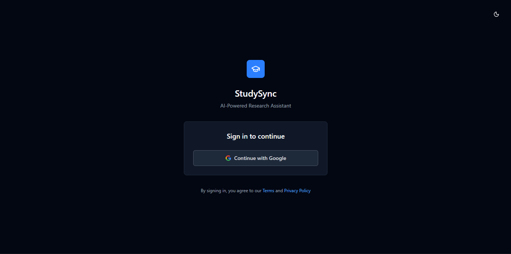
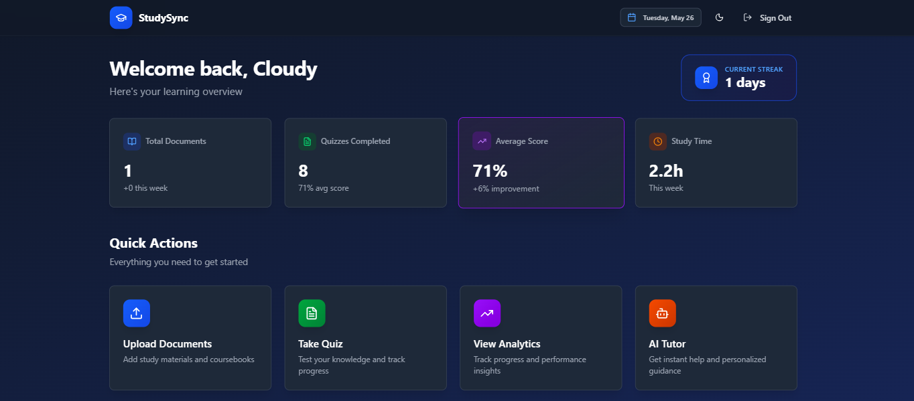
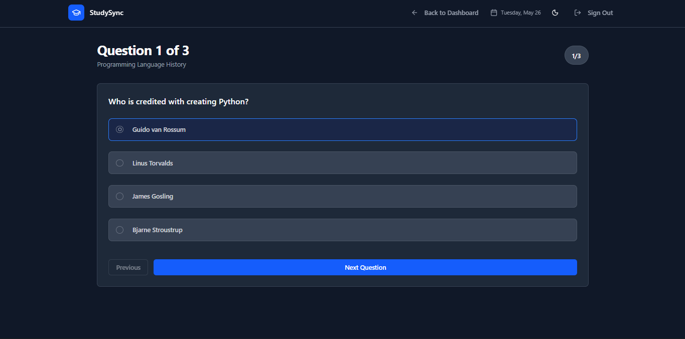
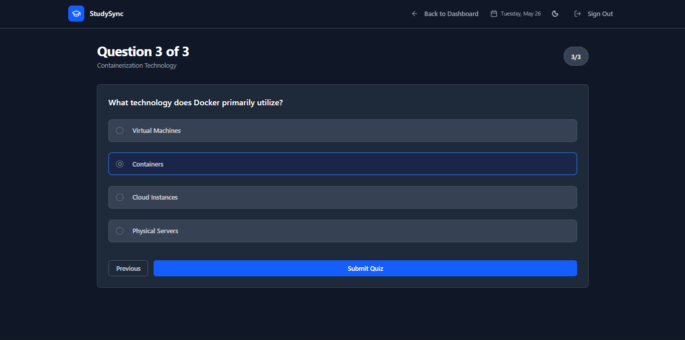
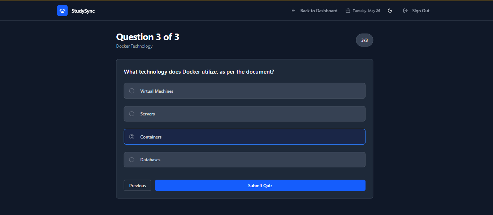
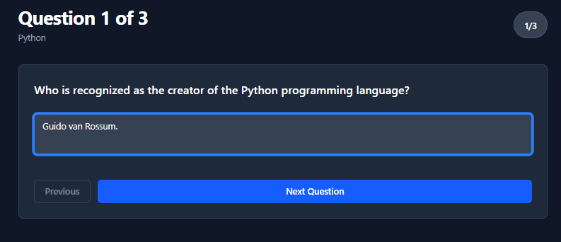
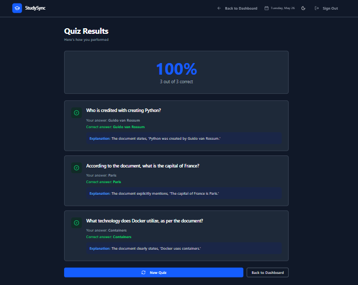

# StudySync

> AI-powered personalized learning platform that helps students learn smarter through intelligent tutoring, document analysis, quiz generation, AI summaries, and performance analytics.

---

## 🌐 Live Demo

https://studysync-8v0b.onrender.com

---

# ✨ Features

## 🤖 AI Tutor

- An intelligent AI-powered study assistant.
- Ask questions on any topic — not limited to uploaded PDFs
- Get instant AI-generated explanations and concept breakdowns
- Learn interactively through natural conversations like chatting with a personal tutor
- Supports programming, computer science, mathematics, theory subjects, interview prep and more
- Combines contextual document understanding with general AI reasoning capabilities
- Designed to provide personalized, real-time academic assistance

---

## 📄 AI Document Analysis
- Upload PDFs and study materials
- Context-aware document chat
- Smart semantic understanding of documents
- AI-powered extraction of important concepts

---

## 📝 AI Quiz Generation
Generate quizzes instantly from uploaded study material.

### Supported Quiz Types
- Multiple Choice Questions (MCQ)
- Short Answer Questions (SAQ)
- Long Answer Questions (LAQ)

### Features
- Automatic evaluation
- Instant explanations
- Smart scoring system
- Quiz history tracking

---

## 📚 AI Summarizer
Generate:
- Quick summaries
- Detailed chapter notes
- Revision notes
- Key concepts
- Exam-focused study material

---

## 📊 Analytics Dashboard
Track learning progress with:
- Quiz performance
- Accuracy tracking
- Learning insights
- Study statistics
- Progress monitoring

---

## 🔍 Semantic Search
Search concepts intelligently inside uploaded documents using AI-powered contextual understanding instead of simple keyword matching.

---

## 🌙 Modern User Experience
- Fully responsive design
- Dark / Light mode
- Clean dashboard UI
- Smooth interactions
- Mobile-friendly layout

---

## 🔐 Authentication & Security
- Secure Google OAuth authentication
- Protected routes
- Session management with NextAuth
- Database-backed authentication system

---

## 📸 Screenshots

### 🔐 Authentication
Secure Google OAuth authentication with protected routes and session management.



---

### 🏠 Dashboard
Centralized AI-powered learning dashboard with document management and analytics.



---

### 📝 AI Quiz Generator
Generate intelligent quizzes with MCQ, SAQ, and LAQ support instantly from study materials.

<table>
  <tr>
    <td></td>
    <td></td>
  </tr>
  <tr>
    <td></td>
    <td></td>
  </tr>
</table>

---

### 📝 AI Quiz Generator
Generate intelligent quizzes with MCQ, SAQ, and LAQ support instantly from study materials.

(./screenshots/quiz2.png)(./screenshots/quiz3.png)(./screenshots/quiz4.png)

---

### 📊 Quiz Results & Evaluation
Real-time quiz evaluation with scoring, explanations, and performance insights.



---

### 📄 PDF Viewer & Document Processing
Upload, preview, and interact with study materials seamlessly.

![PDF Viewer]

---

# 🛠 Tech Stack

## Frontend
- Next.js 15
- React
- TypeScript
- Tailwind CSS
- shadcn/ui
- Framer Motion
- Lucide Icons

---

## Backend
- tRPC
- Prisma ORM
- PostgreSQL
- Redis
- NextAuth.js

---

## AI & Vector Technologies
- Google Gemini AI
- HuggingFace API
- Qdrant Vector Database
- RAG-based document retrieval

---

## Infrastructure & Deployment
- Render
- Supabase
- Docker

---

# 📂 Project Structure

```bash
src/
├── app/
├── components/
├── server/
├── lib/
├── hooks/
├── styles/
├── trpc/
├── types/
└── prisma/
```

---

# ⚙️ Environment Variables

Create a `.env` file in the root directory.

```env
AUTH_SECRET=
AUTH_TRUST_HOST=

DATABASE_URL=
DIRECT_URL=

GOOGLE_CLIENT_ID=
GOOGLE_CLIENT_SECRET=

GOOGLE_GENERATIVE_AI_API_KEY=
HUGGINGFACE_API_KEY=

NEXT_PUBLIC_AFF_URL=

NEXT_PUBLIC_SUPABASE_ANON_KEY=
NEXT_PUBLIC_SUPABASE_URL=

NEXTAUTH_SECRET=
NEXTAUTH_URL=

QDRANT_API_KEY=
QDRANT_URL=

REDIS_URL=

SUPABASE_SERVICE_ROLE_KEY=
SUPABASE_URL=
```

---

# 🚀 Getting Started

## 1️⃣ Clone Repository

```bash
git clone https://github.com/roshankodi/StudySync.git
cd StudySync
```

---

## 2️⃣ Install Dependencies

```bash
npm install
```

---

## 3️⃣ Generate Prisma Client

```bash
npx prisma generate
```

---

## 4️⃣ Push Database Schema

```bash
npx prisma db push
```

---

## 5️⃣ Start Development Server

```bash
npm run dev
```

Application will run on:

```txt
http://localhost:3000
```

---

# 🐳 Docker Support

Build Docker image:

```bash
docker build -t studysync .
```

Run container:

```bash
docker run -p 3000:3000 studysync
```

---

# 🧠 AI Capabilities

StudySync uses Retrieval-Augmented Generation (RAG) architecture to:
- Understand uploaded documents
- Generate context-aware responses
- Create intelligent quizzes
- Summarize learning materials
- Deliver personalized tutoring experiences

---

# 📈 Future Improvements

- Flashcard generation
- Voice AI tutor
- Collaborative study rooms
- Real-time multiplayer quizzes
- Personalized learning recommendations
- Advanced semantic evaluation
- Multi-document reasoning

---

# 👨‍💻 Author

## Kodi Roshan

Computer Science Engineering Student  
Full-Stack Developer & AI Enthusiast

GitHub:
https://github.com/roshankodi

---

# 📄 License

This project is licensed under the MIT License.

---

# ⭐ Support

If you found this project useful:

- Star the repository
- Fork the project
- Share feedback and suggestions

---

# 📬 Contact

For collaborations, suggestions, or contributions, feel free to open an issue or connect through GitHub.